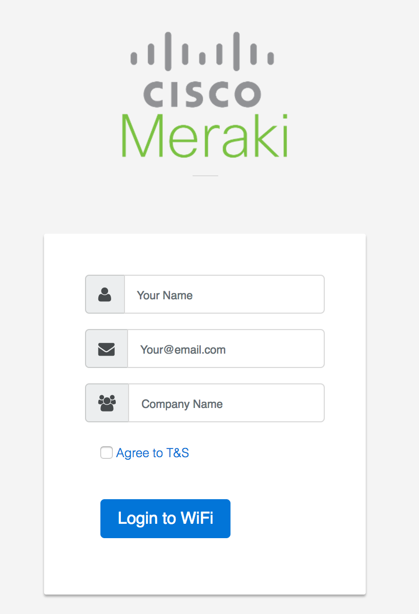

#  Meraki Captive Portal
*w/ Firebase Hosting and Database*

*Static HTML/JS/CSS Site for a Click-through Splash Page*


## Overview
Cisco Meraki provides cloud managed WiFi with the ability to host your own "Splash Page", which is a captive portal service for authenticating users to join the network. This concept is called an External Captive Portal (ExCaP). 

Meraki provides two splash page modes, **click-through** and **sign-on**. This application will use the click-through method.


### Sample URL received from Meraki to this page.
*You can use this URL to test your application without an access point*
```
http://YourAppName.firebaseapp.com/?base_grant_url=https%3A%2F%2Fn143.network-auth.com%2Fsplash%2Fgrant&user_continue_url=http%3A%2F%2Fspeedof.me%2F&node_id=149624922840090&node_mac=88:15:44:60:1c:1a&gateway_id=149624922840090&client_ip=10.255.60.208&client_mac=f4:5c:89:9b:17:67
```

## Installation
* Clone this repo and change into the directory
```
$ git clone https://github.com/gmd11390/captiveportal-firebase.git
```
* Update your Firebase Config settings in `./js/MerakiFirebase.js`. This information is found in your Google Firebase Console.
```
// Initialize Firebase -- UPDATE THIS
var config = {
    apiKey: "YourAPIKey",
    authDomain: "YourAppName.firebaseapp.com",
    databaseURL: "https://YourAppName.firebaseio.com",
    projectId: "YourProjectID",
    storageBucket: "YourAppName.appspot.com",
    messagingSenderId: "YourSenderId"
};
```
* Install and configure Google Firebase Hosting

*NodeJS must be installed for the `npm` command to work*
```
$ npm install -g firebase-tools
$ firebase init    # Generate a firebase.json (REQUIRED)
$ firebase serve   # Start development server
$ firebase deploy  # Push changes to Firebase Hosting
```
* Configure the Meraki wireless SSID with a Click-Through splash page authentication
    * Meraki Dashboard --> Configure --> Splash Page: Click-through
* Add the domain address of the webserver to the "Walled Garden" 
    * Meraki Dashboard --> Configure --> Access Control --> SSID:yourSSID --> Walled Garden.
    * Note: You will need to use the IP address instead of the domain name or contact Meraki Support to enable Walled Garden Domain Names
* Point the Meraki Splash page "Customer URL" to the HTML file. `https://yourserver/`
    * Meraki Dashboard --> Configure --> Splash Page --> Custom URL: `https://yourserver.com/index.html`


## Sample URL paramater string
```
https://yourserver/splash.html?base_grant_url=https%3A%2F%2Fn143.network-auth.com%2Fsplash%2Fgrant&user_continue_url=http%3A%2F%2Fask.com%2F&node_id=149624921787028&node_mac=88:15:44:50:0a:94&gateway_id=149624921787028&client_ip=10.110.154.195&client_mac=60:e3:ac:f7:48:08:22
```

## Screenshot



## Additional Resources
http://developers.meraki.com/tagged/Splash-Pages

### Written by 
Cory Guynn
2017
www.InternetOfLEGO.com


## LICENSE
Apache 2.0 (see [LICENSE](./LICENSE) and [NOTICE](./NOTICE)).
